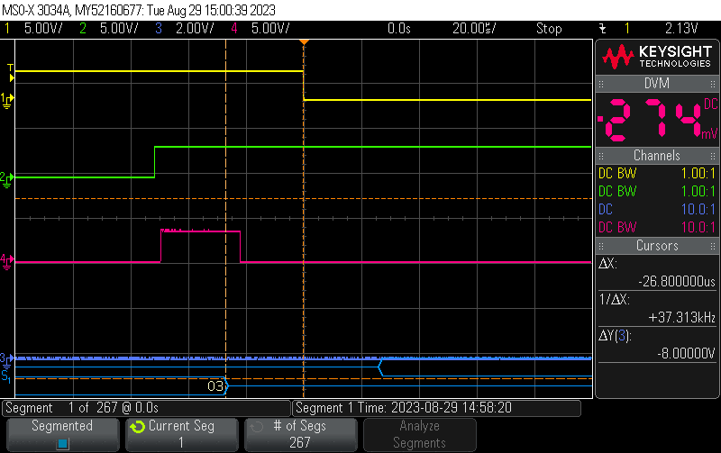

# Scope 0.5 Stop Bit

* yellow: one during one UART Byte :
* green: generated UART Byte including Glitch
* red: RTS Signal from receiving USART PPeripheral (USART1)
* blue: marking a misread uart Byte from previous RUN 
* 
